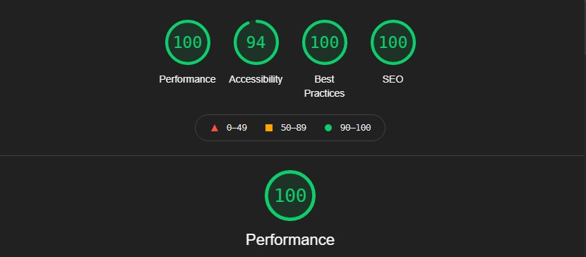

# Portfolio

This project was created in order to practice my skills with HTML, CSS and javaScript. It will also serve to present projects that I have been developing.

## Tech Stack

  
## Demo

  
## Screenshots

  
## Author

- [David Nunes](https://www.github.com/Dnuns)
